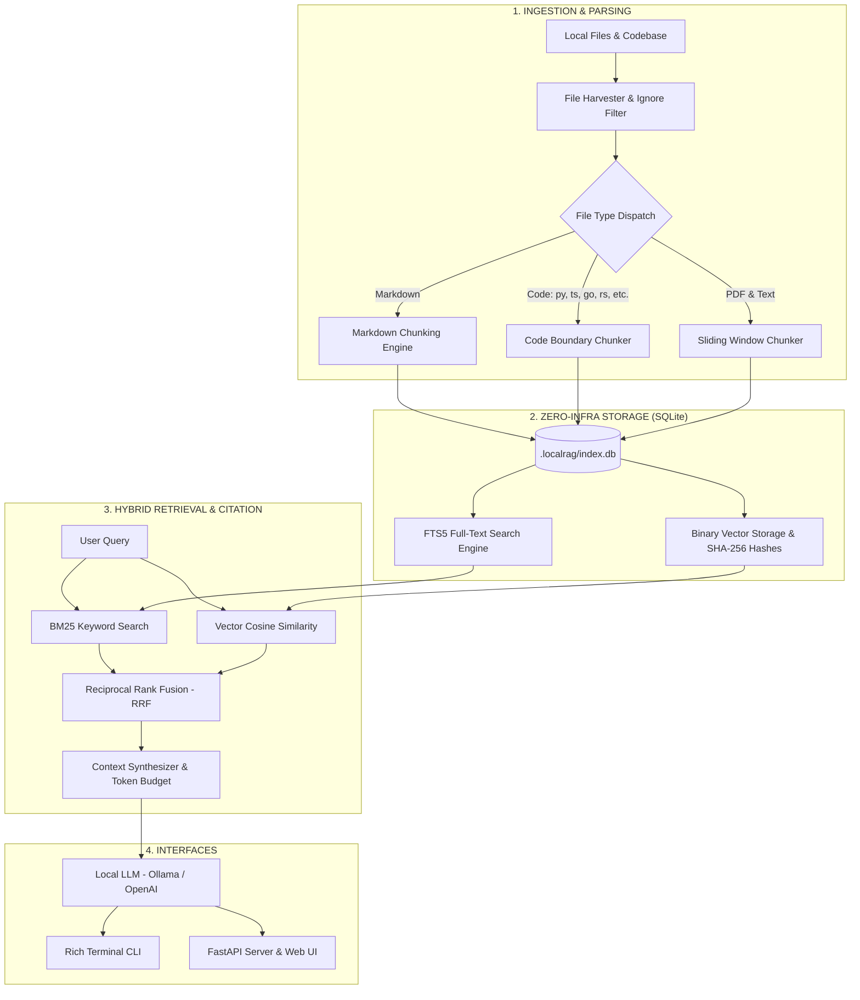

<div align="center">

# ⚡ LocalRAG-Kit

**100% Offline, Privacy-First Local RAG Search & Chat Engine for Codebases and Documents**

[](https://github.com/RitualDev-Lab/localrag-kit/actions)
[](https://www.python.org/downloads/)
[](LICENSE)
[](tests/)
[]()

*Zero cloud vector database fees. Zero telemetry. Zero data leaks.*  
*Indexes your repositories, PDFs, and docs into a single portable SQLite database with hybrid BM25 + dense vector search and an interactive local web UI.*

</div>

---

## ✨ Features

- 🔒 **100% Offline & Air-Gapped**: Runs entirely on your CPU/GPU. No external server dependencies or cloud database subscriptions required.
- ⚡ **Zero-Infra Hybrid Storage**: Pure SQLite database (`.localrag/index.db`) combining SQLite FTS5 (BM25 keyword search) with dense vector embeddings via binary BLOBs and fast NumPy SIMD batch cosine similarity.
- 🎯 **Reciprocal Rank Fusion (RRF)**: Merges semantic vector similarity with exact BM25 keyword rankings ($k_{rrf} = 60$). Solves the classic vector search weakness for exact code symbols, variable names, and error codes.
- 🧩 **Structure-Aware Smart Chunking**:
  - **Code**: Language-aware boundary chunking for Python, JavaScript, TypeScript, Go, Rust, Java, C/C++ that preserves function/class signatures and docstrings.
  - **Markdown**: Heading-aware (`#`, `##`, `###`) chunking that prevents code fences from being broken mid-snippet.
  - **Text / PDF**: Token-aware sliding window with deterministic 1-based start and end line coordinates.
- 🔄 **Incremental SHA-256 Change Detection**: Re-indexing only processes newly created or modified files. Deleted files are automatically cascaded out of SQLite and FTS5 indices.
- 🤖 **Flexible Provider Ecosystem**:
  - **Embeddings**: Built-in zero-download `fast` 384-dim feature hasher, local `ollama` (`nomic-embed-text`), or `openai`.
  - **LLMs**: Local `ollama` (`llama3.2`, `qwen2.5`, `mistral`), `openai`, or mock testing agent.
- 🖥️ **Interactive Web Interface**: Clean, dark-mode glassmorphic Tailwind UI featuring real-time SSE token streaming, inline citation badges, a source inspector slideout drawer, and live index management.
- 💻 **Feature-Rich CLI**: Built with `rich` for colorful terminal tables, progress bars, interactive query synthesis, and streaming terminal output.

---

## 🏛️ System Architecture



---

## 🚀 Quickstart

### 1. Installation

```bash
# Clone repository
git clone https://github.com/RitualDev-Lab/localrag-kit.git
cd localrag-kit

# Create virtual environment
python -m venv .venv
source .venv/bin/activate  # On Windows: .venv\Scripts\Activate.ps1

# Install in editable mode
pip install -e .
```

### 2. Index Any Folder or Codebase

```bash
# Preview files and chunk distribution without writing to disk
localrag scan ./my-project --preview

# Index files into pure SQLite (uses offline fast hasher by default)
localrag index ./my-project

# Or index with local Ollama embeddings:
localrag index ./my-project --embed-provider ollama --embed-model nomic-embed-text
```

### 3. Ask Questions from the Terminal

```bash
# Ask with hybrid retrieval and local Ollama
localrag ask "How does the authentication middleware work?" --mode hybrid --llm ollama

# Search matching chunks with line coordinates
localrag search "create_app" --mode hybrid --limit 5
```

### 4. Launch the Web Interface

```bash
localrag serve ./my-project --port 8000
```
Open `http://127.0.0.1:8000` in your browser to access the interactive web console.

---

## 🛠️ CLI Command Reference

| Command | Description | Example |
| :--- | :--- | :--- |
| `localrag scan` | Inspect eligible files, token estimates, and chunk counts without indexing | `localrag scan . --preview` |
| `localrag index` | Incremental or full indexing of workspace files into SQLite + FTS5 | `localrag index . --full` |
| `localrag search` | Perform hybrid RRF, BM25 keyword, or vector similarity search | `localrag search "token" --mode hybrid` |
| `localrag ask` | Query workspace with streaming grounded LLM answers and citations | `localrag ask "Explain routes.py" --llm ollama` |
| `localrag stats` | Display index statistics, chunk counts, database size, and providers | `localrag stats .` |
| `localrag serve` | Launch the FastAPI server and embedded glassmorphic web UI | `localrag serve . --port 8000` |

---

## 💻 Python API Usage

LocalRAG-Kit can also be embedded directly into your Python scripts and services:

```python
from pathlib import Path
from localrag.storage import SQLiteStore
from localrag.providers import FastFeatureEmbeddingProvider, OllamaLLMProvider
from localrag.retrieval import RAGOrchestrator

# Initialize storage and providers
store = SQLiteStore(".localrag/index.db")
embedder = FastFeatureEmbeddingProvider()
llm = OllamaLLMProvider(model="llama3.2")

# Orchestrate grounded retrieval
orchestrator = RAGOrchestrator(
    store=store,
    embedding_provider=embedder,
    llm_provider=llm,
)

# Stream response with citations
stream = orchestrator.stream_answer(
    query="Explain the database schema design",
    mode="hybrid",
    top_k=5,
)

print(f"Citations: {[c.relative_path for c in stream.citations]}")
for token in stream.token_iterator:
    print(token, end="", flush=True)
```

---

## 🌐 REST & SSE Streaming API

When running `localrag serve`, the following API endpoints are exposed:

- `GET /` — Serves the modern Web UI
- `GET /api/status` — Returns workspace stats, chunk counts, and active providers
- `GET /api/files` — Lists all indexed files with line numbers and metadata
- `POST /api/search` — Runs hybrid RRF, BM25, or vector similarity search
- `POST /api/chat` — SSE streaming endpoint (`data: {"type": "token", "token": "..."}`)
- `POST /api/reindex` — Triggers an incremental or full re-index
- `GET /api/chunk/{id}` — Retrieves chunk details and surrounding file context
- `GET /api/file-content` — Reads raw text of a physical workspace file

---

## 🧪 Testing

The test suite contains 31 unit and integration tests covering chunking, FTS5 BM25, vector math, change detection, SSE streaming, and web UI serving:

```bash
pytest -v
```

---

## 📄 License

This project is licensed under the [MIT License](LICENSE).
